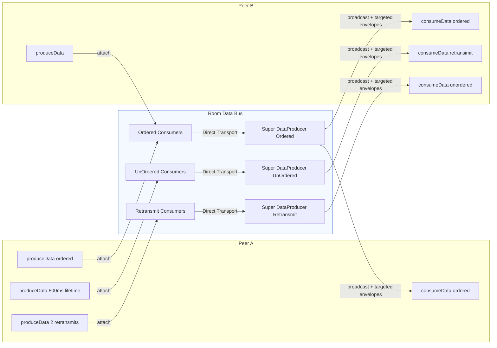

# Signaling and Data Channel Reference

This document summarizes how signaling, media, and room-wide data channels work across `server.js`, `room.js`, `roomDataBus.js`, and `client/main.js`.

## 1. Socket.IO Request/Response Events (`client ↔ server`)

| Event | Direction | Payload (client → server) | Response (server → client) | Purpose / Notes |
| --- | --- | --- | --- | --- |
| `join` | request | `{ roomId, peerId, memberAgentMetaData }` | `{ routerRtpCapabilities, existingProducers[], existingPeers[], roomDataBus }` | Creates or fetches a `Room`, ensures the shared data bus exists, registers the peer, and returns initial state snapshots. |
| `createWebRtcTransport` | request | `{ direction }` (`send` or `recv`) | `{ id, iceParameters, iceCandidates, dtlsParameters, sctpParameters }` | Builds a mediasoup WebRTC transport bound to the requesting peer with proper SCTP configuration. |
| `connectWebRtcTransport` | request | `{ transportId, dtlsParameters }` | `{ ok: true }` | Finalizes DTLS handshake for the identified transport. |
| `produce` | request | `{ transportId, kind, rtpParameters, appData }` | `{ id }` | Creates a mediasoup producer on the peer’s transport. Server relays `newProducer`/`producerClosed` events to other peers. |
| `produceData` | request | `{ transportId, sctpStreamParameters, label, protocol, appData }` | `{ id }` | Creates a mediasoup data producer, attaches it to the `RoomDataBus`, and starts forwarding its messages. |
| `closeProducer` | request | `{ producerId }` | `{ ok: true }` | Silently succeeds even if the peer/room is gone; closes the identified media producer if present. |
| `closeDataProducer` | request | `{ dataProducerId }` | `{ ok: true }` | Same semantics as `closeProducer`, plus detaches the peer’s data producer from the bus. |
| `consume` | request | `{ producerId, transportId, rtpCapabilities }` | `{ id, producerId, kind, rtpParameters, type, producerPaused }` | Validates `router.canConsume`, creates a consumer on the peer’s recv transport, and returns parameters so the client can create its mediasoup consumer instance. |
| `joinDataBus` | request | `{ transportId }` | `{ id, dataProducerId, sctpStreamParameters, label, protocol, appData }` | Adds the peer to the shared data bus (mediasoup `DirectTransport` → `DataProducer`). The client uses the response to build a `consumeData` instance. |
| `resumeConsumer` | request | `{ consumerId }` | `{ ok: true }` | Ensures the peer belongs to a room, then calls `consumer.resume()`. |
| `pauseConsumer` | request | `{ consumerId }` | `{ ok: true }` | Mirror of `resumeConsumer`, pausing the mediasoup consumer. |
| `leave` | fire-and-forget | `∅` | `∅` | Removes the peer from its room and clears `socket.data`. |

All Socket.IO ack responses follow the `{ ok: boolean, error?: string }` structure implemented by `ackSuccess` / `ackError` in `server.js`.

## 2. Server-Initiated Notifications (`server → clients`)

| Event | Payload | Source |
| --- | --- | --- |
| `peerJoined` | `{ peerId, memberAgentMetaData, dataChannels }` | Emitted inside `Room.addPeer` to everyone else so clients can update peer lists and channel metadata. |
| `peerClosed` | `{ peerId, memberAgentMetaData }` | Emitted when a peer disconnects or leaves, prompting UI cleanup. |
| `newProducer` | `{ producerId, peerId, memberAgentMetaData }` | Broadcast when a peer starts producing a new media track. |
| `producerClosed` | `{ producerId, peerId }` | Broadcast when an existing producer ends (transport close, explicit close, or peer removal). |
| `dataChannelAssignment` | `{ subchannelBase, subchannelBucketSize, subchannelRange, broadcastSubchannel, assignedSubchannels[] }` | Emitted by `RoomDataBus.notifyPeerChannelAssignment` whenever a peer is assigned (or reassigned) SCTP subchannels. |
| `dataProducerCreated` | `{ dataProducerId, role, subchannelRange, subchannelBucketSize, broadcastSubchannel }` | Broadcast once by `RoomDataBus.broadcastSuperDataProducerCreated` to announce the shared “super” data producer backing the bus. |

## 3. `Room` Responsibilities (`room.js`)

- Maintains per-peer state: transports, producers, consumers, data producers/consumers, and metadata snapshots.
- Tracks all active producers so it can list them to newcomers (`existingProducers`) and emit lifecycle events (`newProducer`, `producerClosed`).
- Lazily instantiates a `RoomDataBus` via `ensureDataBus` and exposes summarized info through `getDataBusInfo`.
- Provides helper APIs consumed by `server.js`:
  - `createTransport({ peer, direction })`
  - `trackProducer({ peer, producer })`
  - `attachDataProducer` / `detachDataProducer`
  - `createDataBusConsumer({ peer, transport })`
  - `getPeerDataChannelInfo(peerId, { allocate })` used to send each peer’s channel allocation to others.
- Cleans up datastructures and the mediasoup router when the room becomes empty, invoking the `onEmpty` callback supplied during construction.

## 4. Room Data Bus (`roomDataBus.js`)

- Creates a mediasoup `DirectTransport` plus a single ordered `DataProducer` (`label: "room-data-bus"`) that acts as the broadcast hub.
- For each peer data producer, `attachPeerProducer` builds a `consumeData` path into the bus, listens for messages, enforces reserved channel rules, and forwards normalized envelopes to the super producer.
- Assigns deterministic SCTP subchannel buckets:
  - Broadcast subchannel is always `0`.
  - Each peer gets a bucket of size `10` (`SUBCHANNEL_BUCKET_SIZE`) starting at `nextSubchannelBase`.
  - `describePeerChannels`/`getDataBusInfo` expose `{ subchannelBase, subchannelRange, assignedSubchannels }`.
- Message normalization pipeline:
  1. Parse inbound payload, drop reserved system events.
  2. Resolve channel offset / target peer → subchannel list.
  3. Wrap actual payload as `{ from, ts, channel, channelIndex, targetPeerId, target, targetSubchannel?, payload }`.
  4. Serialize to JSON and send through the bus `DataProducer` with optional `subchannels` hint so mediasoup routes it efficiently.
- Handles graceful shutdown by closing all peer inputs/outputs, freeing subchannel assignments, and closing its underlying transport/producer.

### Room Data Bus at a Glance

**Design advantages**

- Single consumer per peer keeps SCTP overhead low while preserving ordered/unordered semantics per subchannel.
- Deterministic subchannel allocation (broadcast bucket + per-peer ranges) avoids stream collisions and simplifies debugging.
- Normalized envelopes add metadata (`from`, `target`, `channelIndex`) so clients can enforce UI or policy decisions without custom parsing per sender.
- Automatic cleanup: when peers leave, the bus detaches their producers/consumers and frees subchannels, preventing leaks.

## 5. Client Integration (`client/main.js`)

1. **Join flow:**
   - Emits `join` and loads `mediasoup-client` `Device` with returned `routerRtpCapabilities`.
   - Seeds UI state with `existingPeers`, `existingProducers`, and `roomDataBus` information.
2. **Transport management:**
   - `ensureSendTransport` / `ensureRecvTransport` wrap `createWebRtcTransport` + `connectWebRtcTransport` and hook into mediasoup’s client-side transport events.
3. **Media production/consumption:**
   - `startMedia` acquires local tracks, calls `transport.produce`, then `request('closeProducer')` on cleanup.
   - `consumeProducer` requests `consume`, instantiates `transport.consume`, tracks remote streams, and issues `resumeConsumer` afterward.
4. **Data bus usage:**
   - `setupDataBus` → `joinDataBus` + `ensureDataProducer` so each peer has one send-side `produceData` and one recv-side `consumeData` linked to the bus.
   - Outgoing payloads use `sendDataMessage`/`sendBinaryPayload`, which build envelopes `{ channel, channelIndex, payload, target? }`. If `target` is absent the message is broadcast.
   - Incoming bus messages are decoded in `handleIncomingData`, filtered via `shouldAcceptEnvelope` against local subchannel allocation, and appended to the UI feed.
   - `dataChannelAllocation` mirrors the server’s assignments; events like `dataChannelAssignment`, `peerJoined`, and `roomDataBus` responses keep it fresh.
5. **Resilience:**
   - Implements transport recovery (`attemptTransportRecovery`) for recv transport failures by recreating consumers/data bus attachments.
   - Automatically cleans state when the socket disconnects or the user clicks "Leave".

## 6. Cross-File Traceability

- `server.js` defines every Socket.IO handler listed in §1 and uses helper methods from `Room` and `RoomDataBus`.
- `room.js` focuses on per-room orchestration plus broadcasting to peers.
- `roomDataBus.js` encapsulates SCTP subchannel management and message normalization.
- `client/main.js` is the canonical reference for how the browser exercises the signaling API and consumes broadcast events.

Use this document as the authoritative map when extending signaling (e.g., adding new events, changing payload shapes, or adjusting data-channel routing).
